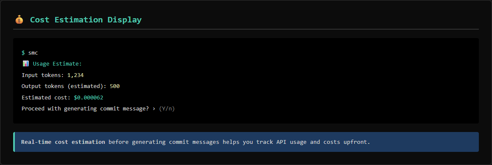
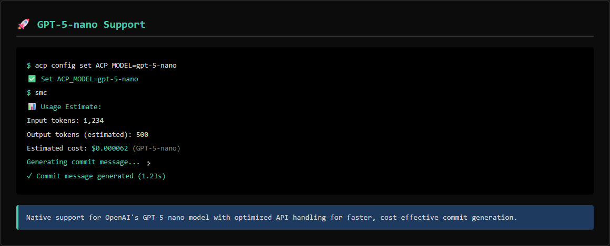
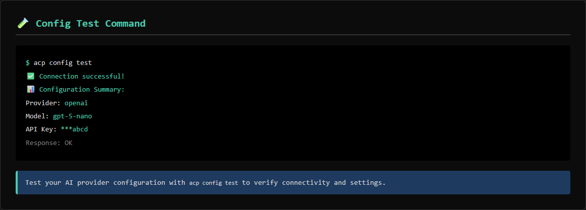
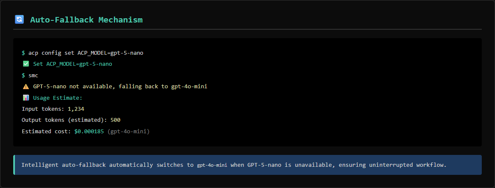
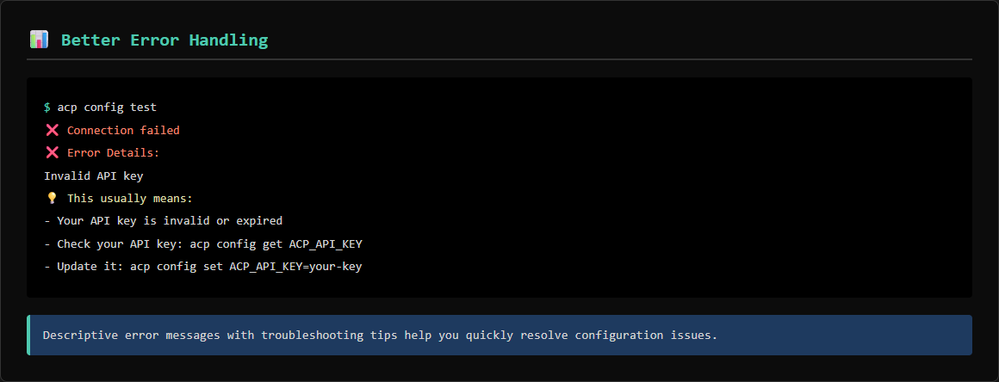
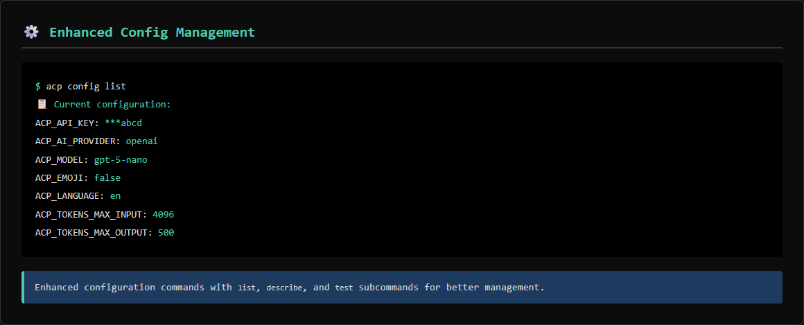

# Alcapush 🚀

> AI-powered git commit message generator with GPT-5-nano support

**Alcapush is a fork of [opencommit](https://github.com/di-sukharev/opencommit)** with enhanced features, better UX, and support for the latest AI models including GPT-5-nano.

[](https://www.npmjs.com/package/alcapush)
[](https://opensource.org/licenses/MIT)

**GitHub Repository:** [https://github.com/dablon/alcapush](https://github.com/dablon/alcapush)

## ✨ Features

- 🤖 **Multiple AI Providers**: OpenAI (GPT-5-nano, GPT-4, GPT-3.5), Anthropic Claude, Google Gemini, Ollama
- 🎯 **Smart Fallback**: Automatically falls back to gpt-4o-mini if GPT-5-nano is not available
- 📝 **Conventional Commits**: Follows the Conventional Commits specification
- 🎨 **GitMoji Support**: Optional emoji prefixes for visual commit history
- 🌍 **Multi-language**: Generate commits in any language
- 💡 **Context-Aware**: Add custom context to improve commit messages
- ⚡ **Fast & Efficient**: Intelligent diff splitting for large changes
- 🎨 **Beautiful CLI**: Colorful output with progress indicators
- 🔧 **Highly Configurable**: Customize everything to match your workflow
- 📜 **Commit History**: View and manage your commit message history
- ⭐ **Favorites**: Save frequently used commit message patterns
- 🌿 **Branch-Aware**: Automatically includes branch context in commit messages

## 🆕 New Features (Compared to OpenCommit)

This fork introduces several enhancements and new capabilities:

- 🚀 **GPT-5-nano Support**: Native support for OpenAI's GPT-5-nano model with optimized API handling
- 🔄 **Intelligent Auto-Fallback**: Automatically falls back to `gpt-4o-mini` if GPT-5-nano is unavailable
- 🧪 **Config Test Command**: Test your AI provider configuration with `acp config test`
- 🎨 **Enhanced CLI Experience**: Improved progress indicators, better error messages, and more intuitive feedback
- 🔗 **Custom API URL Support**: Configure custom API endpoints for enterprise or proxy setups
- 📊 **Better Error Handling**: More descriptive error messages with troubleshooting tips
- ⚙️ **Enhanced Config Management**: Improved configuration commands with `describe` and `test` subcommands
- 🎯 **Optimized GPT-5-nano Integration**: Special handling for GPT-5-nano's unique API format and response structure
- 💰 **Cost Estimation**: Real-time cost estimation before generating commit messages to help you track API usage
- 📜 **Commit History & Favorites**: Track your commit history and save frequently used commit message patterns
- 🌿 **Branch-Aware Commits**: Automatically includes branch context (feature/, fix/, hotfix/, etc.) in commit messages

## 📦 Installation

```bash
npm install -g alcapush
```

## 🚀 Quick Start

1. **Configure your API key**:

```bash
acp config set ACP_API_KEY=sk-your-openai-api-key
```

2. **Make some changes** to your code

3. **Generate and commit**:

```bash
acp
```

That's it! Alcapush will:
- Analyze your changes
- Generate a meaningful commit message
- Ask for confirmation
- Commit your changes

## 🎯 Usage

### Basic Usage

```bash
# Generate commit for staged changes
acp

# Auto-commit without confirmation
acp --yes

# Add additional context
acp -c "Fixing bug reported in issue #123"

# Use full GitMoji specification
acp --fgm
```

### Configuration

```bash
# Set configuration
acp config set KEY=VALUE

# Get configuration value
acp config get KEY

# List all configuration
acp config list

# Describe configuration options
acp config describe
acp config describe ACP_MODEL

# Test your configuration
acp config test
```

### Git Hooks

```bash
# Install git hooks (prepare-commit-msg and commit-msg)
acp hook install

# Check hook status
acp hook status

# Uninstall git hooks
acp hook uninstall
```

**Installed Hooks:**
- **prepare-commit-msg**: Automatically generates commit messages when you run `git commit` without a message
- **commit-msg**: Validates commit messages against Conventional Commits specification

After installing hooks, you can simply run `git commit` and Alcapush will automatically generate and validate your commit messages!

### Commit History & Favorites

```bash
# View commit history (last 50 commits)
acp history

# View commit history with custom limit
acp history 20

# Clear commit history
acp history clear

# Add a commit message to favorites
acp favorite add "feat: add user authentication"

# Remove a commit message from favorites
acp favorite remove "feat: add user authentication"

# List all favorites (sorted by usage)
acp favorite list
```

**Features:**
- 📜 **Automatic History**: All commits are automatically saved to history with branch information
- ⭐ **Favorites**: Save frequently used commit message patterns for quick reference
- 📊 **Usage Tracking**: Favorites are sorted by usage count to show your most-used patterns
- 🔍 **Branch Context**: History includes branch information for better context

### Branch-Aware Commit Messages

Alcapush automatically detects your current branch and includes branch context in commit message generation:

```bash
# On feature/user-auth branch
git checkout -b feature/user-auth
acp
# AI will suggest: feat(user-auth): ... based on branch name

# On fix/login-bug branch
git checkout -b fix/login-bug
acp
# AI will suggest: fix(login-bug): ... based on branch name

# On hotfix/security-patch branch
git checkout -b hotfix/security-patch
acp
# AI will suggest: fix(security-patch): ... based on branch name
```

**Supported Branch Patterns:**
- `feature/` or `feat/` → Suggests `feat` type
- `fix/` or `bugfix/` → Suggests `fix` type
- `hotfix/` → Suggests `fix` type
- `chore/` → Suggests `chore` type
- `docs/` → Suggests `docs` type
- `refactor/` → Suggests `refactor` type
- `test/` → Suggests `test` type
- `perf/` → Suggests `perf` type
- `release/` → Suggests `chore` type

**Scope Extraction:**
- Automatically extracts scope from branch names (e.g., `feature/user-auth` → scope: `user-auth`)
- Cleans up ticket numbers and other patterns (e.g., `feature/JIRA-123-auth` → scope: `auth`)
- Works with multi-level branch names (e.g., `feature/api/user-auth` → scope: `api/user-auth`)

## ⚙️ Configuration Options

| Option | Description | Default |
|--------|-------------|---------|
| `ACP_API_KEY` | API key for the AI provider | - |
| `ACP_AI_PROVIDER` | AI provider (openai, anthropic, gemini, ollama) | `openai` |
| `ACP_MODEL` | Model name | `gpt-5-nano` (fallback: `gpt-4o-mini`) |
| `ACP_TOKENS_MAX_INPUT` | Max input tokens | `4096` |
| `ACP_TOKENS_MAX_OUTPUT` | Max output tokens | `500` |
| `ACP_EMOJI` | Enable GitMoji emojis | `false` |
| `ACP_LANGUAGE` | Language for commit messages | `en` |
| `ACP_DESCRIPTION` | Add detailed description | `false` |
| `ACP_ONE_LINE_COMMIT` | Generate one-line commits | `false` |
| `ACP_API_URL` | Custom API URL | - |

## 🤖 AI Provider Setup

### OpenAI (Default)

```bash
acp config set ACP_AI_PROVIDER=openai
acp config set ACP_API_KEY=sk-...
acp config set ACP_MODEL=gpt-5-nano  # or gpt-4o, gpt-4o-mini
```

### Anthropic Claude

```bash
acp config set ACP_AI_PROVIDER=anthropic
acp config set ACP_API_KEY=sk-ant-...
acp config set ACP_MODEL=claude-3-5-sonnet-20241022
```

### Google Gemini

```bash
acp config set ACP_AI_PROVIDER=gemini
acp config set ACP_API_KEY=your-gemini-key
acp config set ACP_MODEL=gemini-pro
```

### Ollama (Local)

```bash
# Start Ollama first
ollama run mistral

# Configure Alcapush
acp config set ACP_AI_PROVIDER=ollama
acp config set ACP_MODEL=mistral
```

## 🎨 Examples

### Enable GitMoji

```bash
acp config set ACP_EMOJI=true
acp
# Output: ✨ feat: add user authentication
```

### Add Detailed Descriptions

```bash
acp config set ACP_DESCRIPTION=true
acp
# Output:
# feat: add user authentication
#
# Implemented JWT-based authentication system with login and
# registration endpoints. Added middleware for protected routes.
```

### Multi-language Support

```bash
acp config set ACP_LANGUAGE=es
acp
# Output: feat: agregar autenticación de usuario
```

### One-line Commits

```bash
acp config set ACP_ONE_LINE_COMMIT=true
acp
# Output: feat: add user authentication
```

### Commit History Example

```bash
# View your commit history
$ acp history

📜 Commit History (last 10 commits):

  1. feat(auth): add user authentication [feature/user-auth] ⭐
     12/15/2024, 2:30:45 PM

  2. fix(login): resolve session timeout bug [fix/login-bug]
     12/15/2024, 1:15:20 PM

  3. docs: update API documentation [main]
     12/14/2024, 4:22:10 PM
```

### Favorites Example

```bash
# Add frequently used patterns
$ acp favorite add "feat: add new feature"
✅ Added to favorites: feat: add new feature

$ acp favorite add "fix: resolve bug"
✅ Added to favorites: fix: resolve bug

# List favorites
$ acp favorite list

⭐ Favorites (2):

  1. feat: add new feature (used 5x)
     Added: 12/10/2024

  2. fix: resolve bug (used 3x)
     Added: 12/08/2024
```

### Branch-Aware Example

```bash
# Create a feature branch
$ git checkout -b feature/payment-integration

# Make changes and commit
$ acp
# AI will automatically:
# - Detect branch type: feature
# - Extract scope: payment-integration
# - Suggest commit type: feat
# - Include branch context in prompt

# Generated message might be:
# feat(payment-integration): add Stripe payment integration
```

## 💰 Cost Estimation

Alcapush provides real-time cost estimation before generating commit messages, helping you understand the API usage and costs upfront.

### How It Works

Before generating a commit message, Alcapush displays:
- **Input tokens**: Estimated tokens in your diff and prompts
- **Output tokens**: Estimated tokens for the generated message
- **Estimated cost**: Calculated cost in USD based on your selected model

### Example Output

```bash
$ acp

📊 Usage Estimate:
   Input tokens: 1,234
   Output tokens (estimated): 500
   Estimated cost: $0.000062

Proceed with generating commit message? › (Y/n)
```

### Supported Models & Pricing

Alcapush includes up-to-date pricing for popular models:

| Model | Input (per 1M tokens) | Output (per 1M tokens) |
|-------|---------------------|----------------------|
| GPT-5-nano | $0.05 | $0.40 |
| GPT-4o-mini | $0.15 | $0.60 |
| GPT-4o | $2.50 | $10.00 |
| Claude 3.5 Sonnet | $3.00 | $15.00 |
| Gemini Pro | $0.50 | $1.50 |
| Ollama (local) | Free | Free |

*Pricing is automatically calculated based on current API rates (verified November 2024)*

### Cost Optimization Tips

- Use `gpt-5-nano` or `gpt-4o-mini` for the lowest costs
- Use Ollama for free local processing
- Adjust `ACP_TOKENS_MAX_OUTPUT` to limit output token usage
- Use `ACP_TOKENS_MAX_INPUT` to control input size for large diffs

## 📸 Screenshots

### Cost Estimation Display


*Real-time cost estimation before generating commit messages*

### GPT-5-nano Support


*Native GPT-5-nano integration with optimized API handling*

### Config Test Command


*Test your AI provider configuration with `acp config test`*

### Enhanced CLI with Progress Indicators


*Beautiful CLI with colorful progress indicators and better feedback*

### Auto-Fallback Mechanism


*Automatic fallback to gpt-4o-mini when GPT-5-nano is unavailable*

### Enhanced Error Messages


*Descriptive error messages with troubleshooting tips*

### Config Management


*Enhanced configuration commands with describe and test subcommands*

## 🆚 Comparison with OpenCommit

| Feature | Alcapush | OpenCommit |
|---------|-------------|------------|
| GPT-5-nano Support | ✅ | ❌ |
| Auto-fallback Mechanism | ✅ | ❌ |
| Cost Estimation | ✅ | ❌ |
| Config Test Command | ✅ | ❌ |
| Custom API URL Support | ✅ | ❌ |
| Enhanced Error Messages | ✅ | ❌ |
| Colorful CLI | ✅ | ✅ |
| Progress Indicators | ✅ | ❌ |
| Multiple AI Providers | ✅ | ✅ |
| GitMoji Support | ✅ | ✅ |
| Config Management | ✅ | ✅ |
| Context Flag | ✅ | ✅ |
| Commit History | ✅ | ❌ |
| Favorites | ✅ | ❌ |
| Branch-Aware Commits | ✅ | ❌ |

## 🛠️ Development

```bash
# Clone the repository
git clone https://github.com/dablon/alcapush.git
cd alcapush

# Install dependencies
npm install

# Build
npm run build

# Link locally
npm link

# Test
acp
```

## 📝 License

MIT © Nicolas Alcaraz

## 🤝 Contributing

Contributions are welcome! Please feel free to submit a Pull Request.

## 🙏 Acknowledgments

**Alcapush is a fork of [opencommit](https://github.com/di-sukharev/opencommit)** by [di-sukharev](https://github.com/di-sukharev).

This project extends opencommit with additional features and improvements while maintaining compatibility with the original tool's core functionality. We're grateful to the opencommit team for creating such a great foundation.

## 📧 Support

If you have any questions or issues, please open an issue on GitHub.

